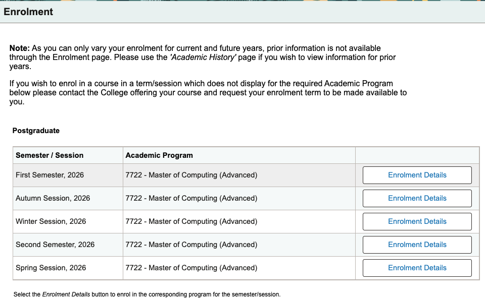
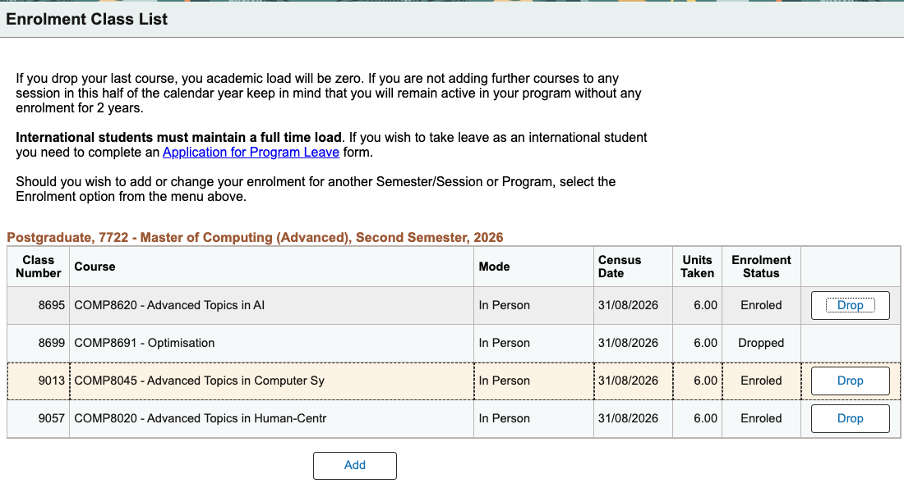
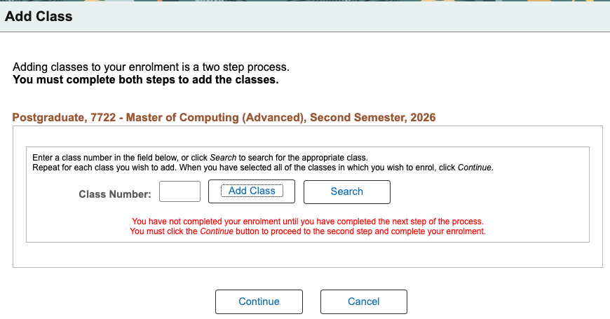
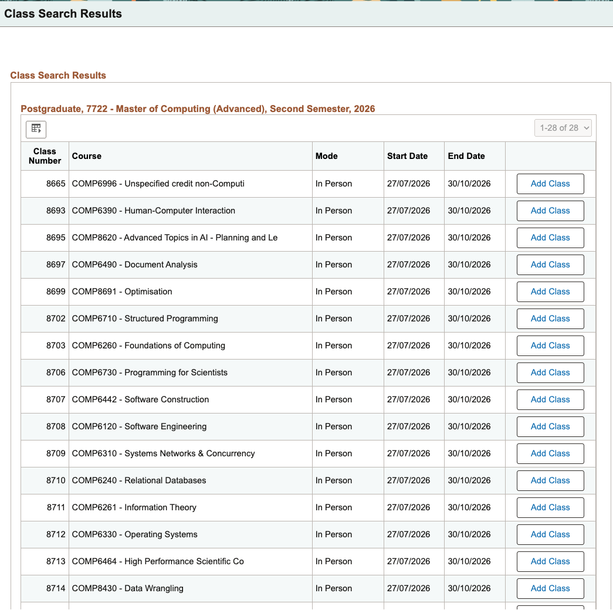
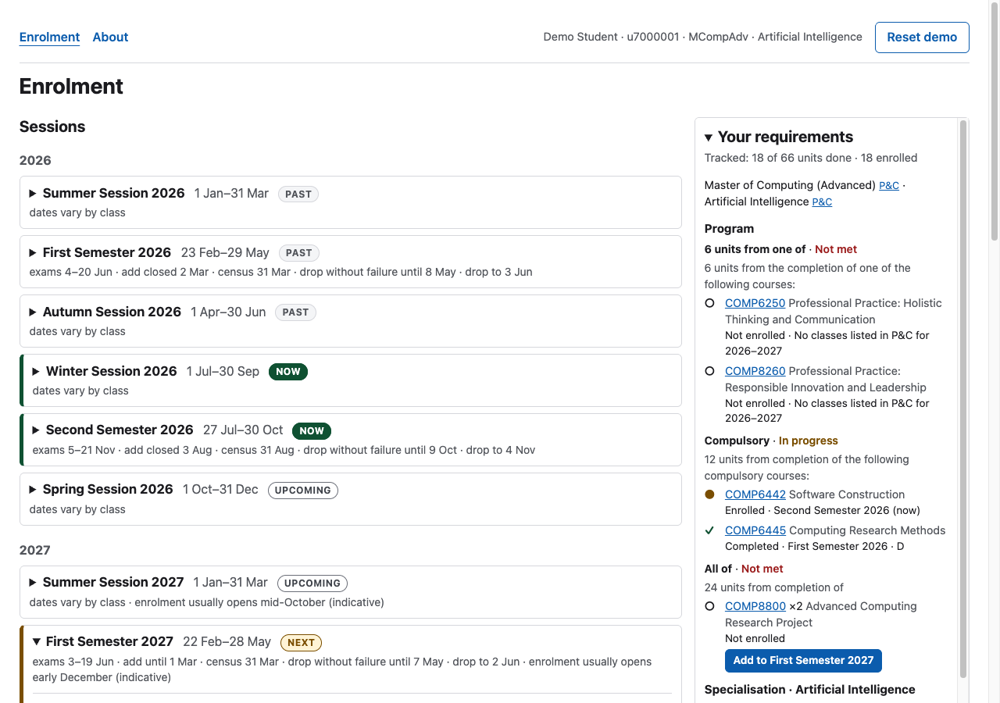
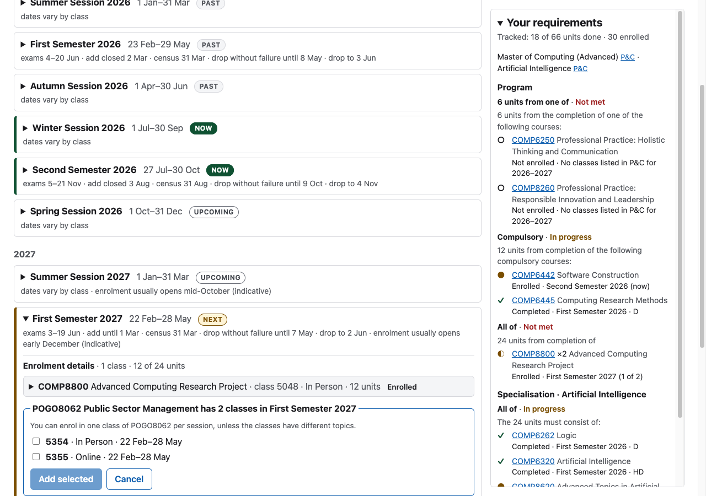
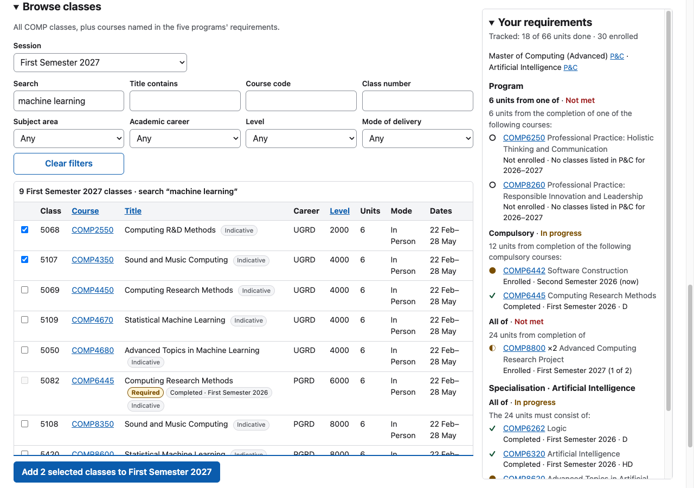
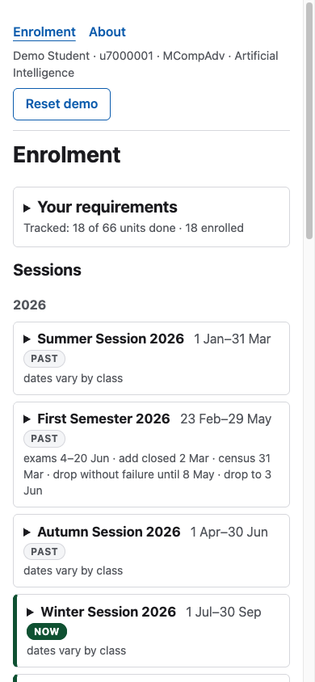

# Enrolment, redesigned

A working prototype of ANU's class enrolment page (ANUHub, formerly ISIS),
rebuilt as one page: add a class by its class number **or its course code**,
browse every class in a filterable table, see which session is on now and
which one you are enrolling for, unfold a session's enrolment details in
place, and keep your program's requirements beside you while you do it. Every
course fact on the page comes from ANU's public Programs & Courses site; the
demo student is the only invented data.

Live: <https://comp4020-crit7-rangermix.fly.dev>

## What good looks like here

A student should get from "I need COMP8800 next semester" to enrolled
**without leaving the page and without looking up a class number**, and at
every moment the page should answer three questions at a glance: *which
session am I enrolling in? what am I enrolled in? what do I still need?*

The design started from the current flow, looked at read-only in a signed-in
ANUHub session and in ANU's own enrolment guides. Adding one class there takes
six or more screens that replace each other: a session list with no dates, a
class list with titles cut at about forty characters and no unit total, an
Add Class form that takes class numbers only, a search that demands a
career and a subject area, and a Continue-then-Save wizard. The redesign's
answers:

| ANUHub today | This prototype |
|---|---|
| A session list with no dates and no current or next marker. | Every session shows its dates and key deadlines (exams, add, census, drop), badged **Now**, **Next** or **Upcoming**. |
| Enrolment Details replaces the list; changing session means backing out. | Each session is a disclosure row: its enrolment details unfold in place. |
| Class numbers only, looked up elsewhere. | A class number **or** a course code. A course with one class is added directly; a course with several opens an inline chooser showing each class's mode and dates. |
| Search needs a career and a subject area, and adds one class per click. | Every filter is optional, search covers codes, titles and descriptions, and several classes can be added at once. |
| Program requirements live on another site, as prose. | A sidebar tracks the program's and major's course lists, with each course's status and a one-click Add. |









*Before: crops of the live ANUHub pages, 24 September 2026, reproduced with
the student's permission.*









**What is enforced, and where.** The rules above are pinned by contract
tests that run against the built server (`spec/`): the badges and dates, the
in-place details, every add path and its messages, the 24-unit cap, drop
deadlines, persistence across a reload, sandbox isolation, the catalogue's
filters and links, the sidebar's statuses, and that every course code on the
page exists in the snapshot. axe runs on every server-rendered state in the
suite, and a real-browser pass checked contrast, keyboard use and the phone
layout. **Judgement calls** that no test settles: the wording, which
requirement prose counts as a trackable course list, and the layout.

**What it deliberately leaves out.** Real sign-in, permission codes,
prerequisite checking (P&C publishes prerequisites only as prose, so the page
shows them and doesn't enforce them), undo (the reverse of an add is a drop),
swap, overloads, fees, seats and waitlists, tutorials, and any rule in a
program that isn't a list of courses — those are shown verbatim under
"Other rules, not tracked".

## Where the data comes from

- **Programs & Courses** (programsandcourses.anu.edu.au) is the source of
  truth for courses, classes, dates, modes, topics and requirement lists. A
  polite, cached crawler (`scripts/pc/`) fetched it once on 24 September 2026,
  at the student's direction, with an honest User-Agent and at most one request
  a second: every 2026–27 COMP course, five computing programs (Bachelor of
  Computing, both Advanced Computing honours degrees, and both Masters of
  Computing), five majors or specialisations each, and every course their
  requirements name. The normalised snapshot is committed in `src/data/pc/`;
  its provenance, every override and every gap is recorded in
  `src/data/pc/README.md`. The app never talks to P&C.
- **The university calendar** supplies what P&C doesn't: session spans, exam
  periods and deadlines (`src/data/calendar.json`, with the source on each row).
- Offerings for 2027 are P&C's own "indicative" list, and the page says so.

## The demo student

There is no ANU sign-in. Each browser gets its own copy of a demo student —
u7000001, Master of Computing (Advanced) with the Artificial Intelligence
specialisation, part-way through 2026 — the moment it first changes something,
so visitors never see each other's enrolments. **Reset demo** starts the copy
again. The student's history uses real P&C offerings; the grades are invented
(`src/data/templates/README.md`).

## Running it

```bash
pnpm install
pnpm dev                              # http://localhost:4321
pnpm check                            # type check, build, then every test
pnpm data:fetch && pnpm data:build    # refresh the P&C snapshot (network; about 4 minutes)
```

## How it's built

An Astro server renders the whole page for the visitor's student and a React
island hydrates it; after that every change happens in place through a small
JSON API whose every write returns the full new view, so the page, the
validation and the sidebar can't disagree. SQLite (Drizzle) holds the snapshot
and the sandboxes. The design is in
`docs/superpowers/specs/2026-09-23-enrolment-redesign-design.md`, the build plan
in `docs/superpowers/plans/2026-09-24-enrolment-redesign.md`, and the research
behind both in `docs/research/`.
